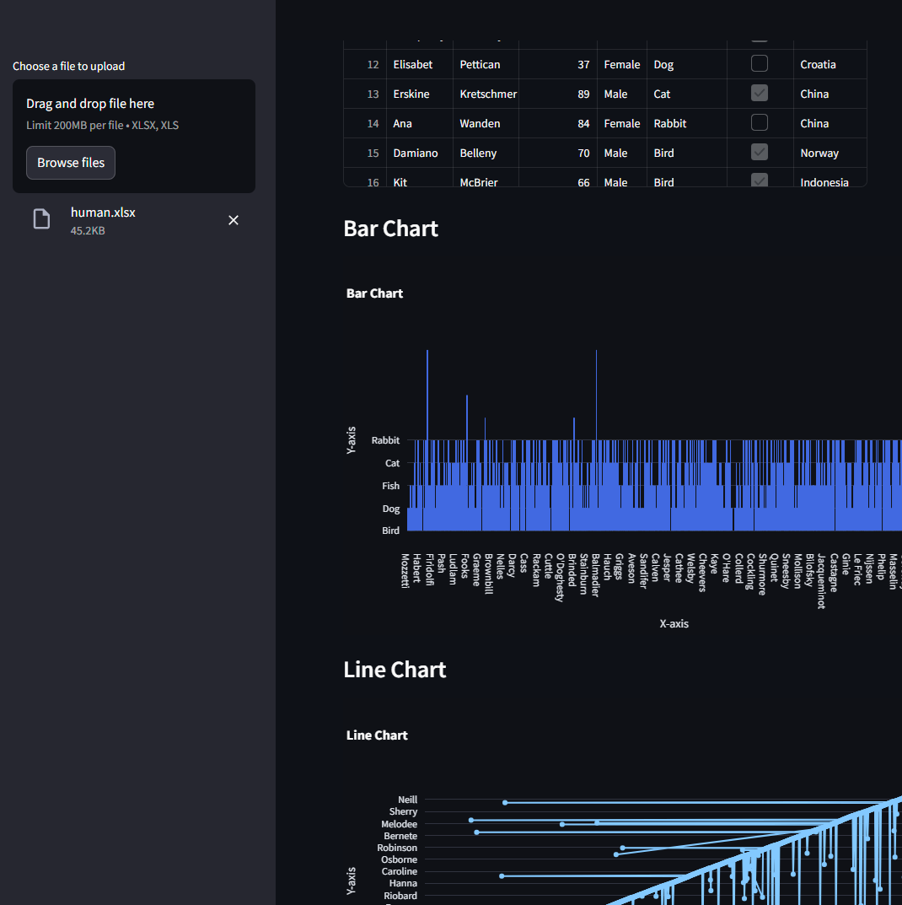

# Workflow-Dashboard

This app allows users to upload Excel files and visualize the data using Streamlit and Plotly. Users can view the data in a table and create various charts, including bar charts, line charts, and 3D scatter plots. The app is user-friendly, with a sidebar for file uploads and automatic data processing and visualization.

## Displamer

Seed data was randomly made with the help of:

https://www.mockaroo.com

The data in the excel file is randomized and does not represent real human people.